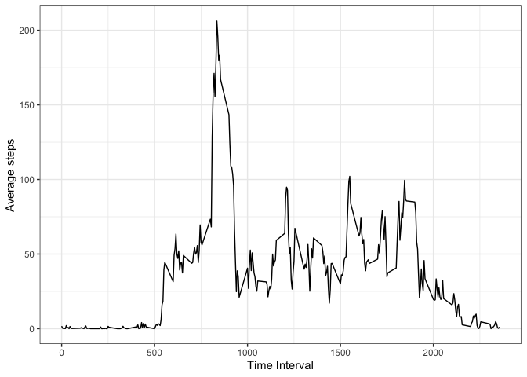

## Loading and preprocessing the data

First load the data 


```r
library(tidyverse)
```

```
## ── Attaching packages ─────────────────────────────────────── tidyverse 1.3.1 ──
```

```
## ✓ ggplot2 3.3.5     ✓ purrr   0.3.4
## ✓ tibble  3.1.6     ✓ dplyr   1.0.8
## ✓ tidyr   1.2.0     ✓ stringr 1.4.0
## ✓ readr   2.1.2     ✓ forcats 0.5.1
```

```
## ── Conflicts ────────────────────────────────────────── tidyverse_conflicts() ──
## x dplyr::filter() masks stats::filter()
## x dplyr::lag()    masks stats::lag()
```

```r
df <- read_csv("activity.csv")
```

```
## Rows: 17568 Columns: 3
```

```
## ── Column specification ────────────────────────────────────────────────────────
## Delimiter: ","
## dbl  (2): steps, interval
## date (1): date
## 
## ℹ Use `spec()` to retrieve the full column specification for this data.
## ℹ Specify the column types or set `show_col_types = FALSE` to quiet this message.
```

## What is mean total number of steps taken per day?


```r
# find the mean steps in each day
mean_steps <- df %>%
  group_by(date) %>%
  summarize(mean_steps=mean(steps))

ggplot(mean_steps, aes(mean_steps))+geom_histogram()+labs(x="Mean number of steps per day")+theme_bw()
```

```
## `stat_bin()` using `bins = 30`. Pick better value with `binwidth`.
```

```
## Warning: Removed 8 rows containing non-finite values (stat_bin).
```

<!-- -->

```r
# find the median steps in each day

med_steps <- df %>%
  group_by(date) %>%
  summarize(Median=median(steps), Mean=mean(steps)) 

print(med_steps)
```

```
## # A tibble: 61 × 3
##    date       Median   Mean
##    <date>      <dbl>  <dbl>
##  1 2012-10-01     NA NA    
##  2 2012-10-02      0  0.438
##  3 2012-10-03      0 39.4  
##  4 2012-10-04      0 42.1  
##  5 2012-10-05      0 46.2  
##  6 2012-10-06      0 53.5  
##  7 2012-10-07      0 38.2  
##  8 2012-10-08     NA NA    
##  9 2012-10-09      0 44.5  
## 10 2012-10-10      0 34.4  
## # … with 51 more rows
```

```r
mean(med_steps$Mean, na.rm=T)
```

```
## [1] 37.3826
```

```r
median(med_steps$Median, na.rm=T)
```

```
## [1] 0
```

## What is the average daily activity pattern?

Make a time series plot of the 5-minute interval (x-axis) and the average number of steps taken, averaged across all days (y-axis)

Which 5-minute interval, on average across all the days in the dataset, contains the maximum number of steps?


```r
time <- df %>%
  na.omit() %>%
  group_by(interval) %>%
  summarise(mean=mean(steps))

ggplot(time, aes(x=interval, y=mean))+geom_line()+labs(x="Time Interval", y= "Average steps")+theme_bw()
```

<!-- -->

## Imputing missing values


```r
df2 <- df %>%
  group_by(interval) %>%
  mutate(steps = ifelse(is.na(steps), mean(steps,na.rm = T), steps))


# find the mean steps in each day
mean_steps2 <- df2 %>%
  group_by(date) %>%
  summarize(mean_steps=mean(steps))

ggplot(mean_steps2, aes(mean_steps))+geom_histogram()+labs(x="Mean number of steps per day")+theme_bw()
```

```
## `stat_bin()` using `bins = 30`. Pick better value with `binwidth`.
```

<!-- -->

```r
# find the median steps in each day

med_steps2 <- df2 %>%
  group_by(date) %>%
  summarize(Median=median(steps), Mean=mean(steps)) 

print(med_steps2)
```

```
## # A tibble: 61 × 3
##    date       Median   Mean
##    <date>      <dbl>  <dbl>
##  1 2012-10-01   34.1 37.4  
##  2 2012-10-02    0    0.438
##  3 2012-10-03    0   39.4  
##  4 2012-10-04    0   42.1  
##  5 2012-10-05    0   46.2  
##  6 2012-10-06    0   53.5  
##  7 2012-10-07    0   38.2  
##  8 2012-10-08   34.1 37.4  
##  9 2012-10-09    0   44.5  
## 10 2012-10-10    0   34.4  
## # … with 51 more rows
```

```r
mean(med_steps2$Mean, na.rm=T)
```

```
## [1] 37.3826
```

```r
median(med_steps2$Median, na.rm=T)
```

```
## [1] 0
```


## Are there differences in activity patterns between weekdays and weekends?


```r
df3 <- df %>%
  mutate(day = weekdays(date)) %>%
  mutate(which = ifelse(day %in% c("Saurday", "Sunday"), "Weekend", "Weekday")) %>%
  na.omit() %>%
  group_by(which,interval) %>%
  summarise(mean=mean(steps))
```

```
## `summarise()` has grouped output by 'which'. You can override using the
## `.groups` argument.
```

```r
ggplot(df3, aes(x=interval, y=mean))+geom_line()+facet_wrap(~which, ncol=1)+theme_bw()+labs(x="Time interval", y= "mean steps")
```

<!-- -->
